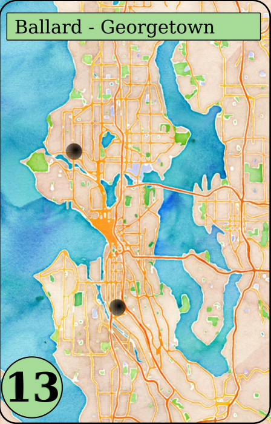

# Make your own Ticket To Ride game (and automate the boring parts)
[Ticket to Ride](https://www.daysofwonder.com/tickettoride/en/usa) is a game where you build train routes between points. It's a perennial favorite of mine, but sadly there are only so many different maps to play on. So I decided to make my own map of Seattle. If you want to do what I did, you'll still need to hand-draw the board, that's not automated (yet), and decide on the placement of markers. Below is what I did to make the first prototype.

## For the board:
First, I hand-drew vector graphics over a map of Seattle in Inkscape, adding in destinations, train boxes, and score track.

To make painting in the lines easier, I covered a flat piece of wood with painter's tape and laser-etched the design into it. Then I peeled out the painter's tape just for the shapes I want to color and filled them in with paint. This part takes a while. Eventually ended up with most of the board filled with paint.

## For the ticket cards:
Used Stamen Design's [watercolor maps](http://maps.stamen.com/#watercolor/) to render a map of Seattle to be more pleasing to the eye. Put that as the base layer of an .svg file sized for a card. Added in a box for the name of the route score amount. Then added in a marker for every possible destination and named it in its title property.

Opened up the .svg file and segmented it into a 'prefix' file (everything that comes before the markers, name and score), suffix (everything that comes after), name (the code for the name box with the place for the name held by the text 'NAME') and score (same as for name but with the text 'SCORE'). I also created a json file that details each destination in the following format:

    'Name (as it appears in the svg)':{'indegree':integer, 'neigh':['neigh1',...],
           'name':'(if it differs from the svg name)'}

Then I ran the generator function in the script, which generates a random subset of the possible pairs of destinations. 

    python generate_cards.py

These can then be converted into PNG files en masse with the command:

    inkscape -z -e Destination.png Source.svg -d 400

## Train cards: to be continued
For now, you'll have to use an already-existant deck.
